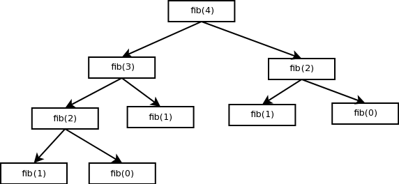

.. include:: beamerdefs.txt
=====================
Memoization Decorator
=====================

:Organization: Utah Python User Group
:Author: Amjith Ramanujam
:Date: Feb 9 2012

Memoization
-----------

|block<| Definition |>|

Memoization is an optimization technique used primarily to speed up computer
programs by having function calls avoid repeating the calculation of results
for previously processed inputs. -Wikipedia.

|end_block|

- Optimization technique.
- Store the results.
- Return stored results when called with same args.

Decorator
---------

|block<| Definition |>|

A decorator is any callable Python object that is used to modify a function,
method or class definition.

|end_block|

- Decorator is a wrapper around exsiting callables.
- Syntactic sugar for decorators is @decorator. Eg:

.. code-block:: python

    @profile 
    def fibonacci(num):
        if num in (0,1):
            return num
        return fibonacci(num-1) + fibonacci(num-2)

Examples
--------

|block<| |>|

.. code-block:: python
    
    def power_of(x,y,z):
        return (x**y)**z

    >>> timeit('math_funcs.power_of(10,30,30)',
               'import math_funcs')
    32.031651973724365

|end_block|

|pause|

|block<| Memoized Version |>|

.. code-block:: python

    import memoized
    @memoized
    def mpower_of(x,y,z):
        return (x**y)**z

|pause|

.. code-block:: python
    
    >>> timeit('math_funcs.mpower_of(10,30,30)',
               'import math_funcs')
    0.70642209053039551

|end_block|

Memoization Decorator
---------------------

http://wiki.python.org/moin/PythonDecoratorLibrary#Memoize

.. code-block:: python

   class memoized(object):
       def __init__(self, func):
          self.func = func
          self.cache = {}
       def __call__(self, * args):
          try:
             return self.cache[args]
          except KeyError:
             value = self.func(* args)
             self.cache[args] = value
             return value
          except TypeError:
             # uncachable -- for instance, passing a list as an argument.
             # Better to not cache than to blow up entirely.
             return self.func(* args)

Fibonacci - Example
-------------------

|block<| Fibonacci |>|

.. code-block:: python

    def fibonacci(num):
        print 'fibonacci(%d)'%num
        if num in (0,1):
            return num
        return fibonacci(num-1) + fibonacci(num-2)

|end_block|

Fibonacci - Call Graph
----------------------

Fibonacci - Without Memoization
-------------------------------

.. code-block:: python

    >>> math_funcs.fibonacci(4)   # 9 function calls
    fibonacci(4)
    fibonacci(3)
    fibonacci(2)
    fibonacci(1)
    fibonacci(0)
    fibonacci(1)
    fibonacci(2)
    fibonacci(1)
    fibonacci(0)
    3

Fibonacci - With Memoization
----------------------------

.. code-block:: python

    >>> math_funcs.mfibonacci(4)  # 5 function calls
    fibonacci(4)
    fibonacci(3)
    fibonacci(2)
    fibonacci(1)
    fibonacci(0)
    3

|pause|

.. code-block:: python

    >>> math_funcs.mfibonacci(4)  # No function calls 
    3                             # cache already has results
    

References
----------

- http://wiki.python.org/moin/PythonDecoratorLibrary#Memoize

- Guide to: Learning Python Decorators by Matt Harrison
  http://www.amazon.com/Guide-Learning-Python-Decorators-ebook/dp/B006ZHJSIM/

