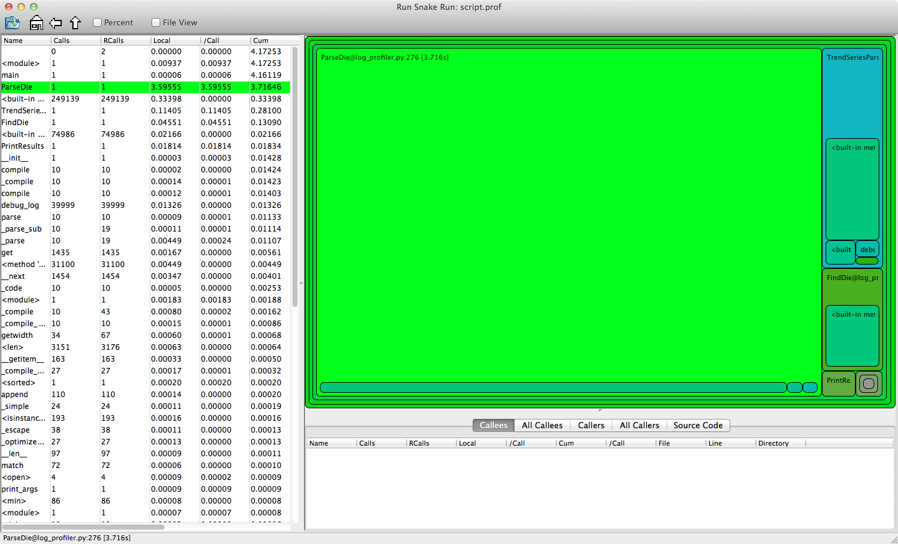

.. include:: beamerdefs.txt
================
Python Profiling
================

:Organization: Utah Python User Group
:Author: Amjith Ramanujam
:Date: 2011-10-13

Profiling a Python Script
-------------------------

|block<| What |>|

Where is the time spent, when the code is running.

|end_block|

|pause|

|block<| Why? |>|

- Optimize intelligently.
- Know the bottle-necks.

|end_block|

|pause|

|block<| How? |>|

Python comes with a few profilers.

- cProfile
- Profile  (older pure python implementation)
- hotshot  (deprecated)

|end_block|

Let's use cProfile
------------------

.. code-block::

    >>> import cProfile
    >>> import lcm
    >>> cProfile.run('lcm.ver_1(2, 3)')
    6 function calls in 0.000 seconds

    Ordered by: standard name
    ncalls  tottime  percall  cumtime  percall filename:lineno(function)
         1    0.000    0.000    0.000    0.000 <string>:1(<module>)
         1    0.000    0.000    0.000    0.000 lcm.py:1(ver_1)
         2    0.000    0.000    0.000    0.000 {max}
         1    0.000    0.000    0.000    0.000 {'_lsprof.Profiler' objects}
         1    0.000    0.000    0.000    0.000 {min}
    
Lowest Common Multiplier
------------------------

**Problem**

Given two numbers a,b find the lowest number c that is divisible by both a and b.

|pause|

**Algorithm:**

::

    1. Start i from the max(a,b)
    2. If i is perfectly divisible by a and b
        i is the answer
    3. Increment i by max(a,b). Goto Step 1.

Lowest Common Multiplier (ver 1)
--------------------------------

.. code-block:: python

    # lcm.py
    def ver_1(arg1, arg2):
        i = max(arg1, arg2)
        while i < (arg1 * arg2):
            if i % min(arg1,arg2) == 0:
                return i
            i += max(arg1,arg2)
        return(arg1 * arg2)

Let's Profile (ver 1)
---------------------
    
.. code-block::

    >>> cProfile.run('lcm.ver_1(21498497, 38901201)')
            42996996 function calls in 25.478 seconds

      Ordered by: standard name

      ncalls  tottime  percall  cumtime  percall filename:lineno(function)
           1    0.000    0.000   25.478   25.478 <string>:1(<module>)
           1   16.358   16.358   25.478   25.478 lcm.py:1(ver_1)
    21498497    4.583    0.000    4.583    0.000 {max}
           1    0.000    0.000    0.000    0.000 {'_lsprof.Profiler' objects}
    21498496    4.537    0.000    4.537    0.000 {min}

Lowest Common Multiplier (ver 2)
--------------------------------

.. code-block:: python

    # lcm.py
    def ver_2(arg1, arg2):
        mx = max(arg1, arg2)
        mn = min(arg1, arg2)
        i = mx
        while i < (arg1 * arg2):
            if i % mn == 0:
                return i
            i += mx
        return(arg1 * arg2)

Let's Profile (ver 2)
---------------------

.. code-block:: 

    >>> cProfile.run('lcm.ver_2(21498497, 38901201)')
             5 function calls in 5.889 seconds

    Ordered by: standard name

    ncalls  tottime  percall  cumtime  percall filename:lineno(function)
         1    0.000    0.000    5.889    5.889 <string>:1(<module>)
         1    5.889    5.889    5.889    5.889 lcm.py:9(ver_2)
         1    0.000    0.000    0.000    0.000 {max}
         1    0.000    0.000    0.000    0.000 {'_lsprof.Profiler'}
         1    0.000    0.000    0.000    0.000 {min}

Lowest Common Multiplier (ver 3)
--------------------------------

.. code-block:: python

    # lcm.py
    def ver_3(arg1, arg2):
        mx = max(arg1, arg2)
        mn = min(arg1, arg2)
        i = mx
        mx_limit = arg1*arg2
        while i < mx_limit:
            if i % mn == 0:
                return i
            i += mx
        return mx_limit

Let's Profile (ver 3)
---------------------

.. code-block:: 

    >>> cProfile.run('lcm.ver_3(21498497, 38901201)')
             5 function calls in 5.232 seconds

    Ordered by: standard name

    ncalls  tottime  percall  cumtime  percall filename:lineno(function)
         1    0.000    0.000    5.232    5.232 <string>:1(<module>)
         1    5.232    5.232    5.232    5.232 lcm.py:19(ver_3)
         1    0.000    0.000    0.000    0.000 {max}
         1    0.000    0.000    0.000    0.000 {'_lsprof.Profiler'}
         1    0.000    0.000    0.000    0.000 {min}

Profile from Command Line
-------------------------

Profiling a whole script. 

.. code-block::

    $ python -m cProfile script.py

    291502 function calls (291393 primitive calls) in 4.368 seconds
    
    Ordered by: standard name
    
    ncalls  tottime  percall  cumtime  percall filename:lineno(function)
         1    0.000    0.000    0.000    0.000 UserDict.py:4(__init__)
         1    0.000    0.000    0.000    0.000 __init__.py:1077(Logger)
         1    0.000    0.000    0.000    0.000 __init__.py:1092(__init__)
         1    0.000    0.000    0.000    0.000 __init__.py:1122(info)
         ...
         ...

Save and Analyze Profiles
-------------------------

**Problem:**

- Small functions are easy to profile in the repl.
- Profiles of bigger programs are messy.
- Sorting by function name is useless.

**Solution:**

- Save the profile to a file.
- Reload the profile and analyze the stats on the profile.

Save the Profile
----------------

Let's save the profile to a file. 

**Interpreter:**

.. code-block:: 

    >>> cProfile.run('lcm.ver_3(21498497, 38901201)',
        'lcm.prof')

**Command Line:**

.. code-block:: 

    $ python -m cProfile -o script.prof script.py

Analyze the Profile
-------------------

.. code-block:: 

    >>> import pstats
    >>> p  = pstats.Stats('script.prof')
    >>> p.sort_stats('cumulative')
    >>> p.print_stats(5)

    402649 function calls (402540 primitive calls) in 4.173 seconds
    Ordered by: cumulative time
    List reduced from 72 to 5 due to restriction <5>
 
    ncalls  tottime  percall  cumtime  percall filename:lineno(function)
         1    0.009    0.009    4.173    4.173 log_profiler.py:33(<module>)
         1    0.000    0.000    4.161    4.161 log_profiler.py:379(main)
         1    3.596    3.596    3.716    3.716 log_profiler.py:276(ParseDie)
    249139    0.334    0.000    0.334    0.000 {built-in method search}
         1    0.114    0.114    0.281    0.281 log_profiler.py:213(TrendSeriesParser)
 

GUI Profile Viewer
------------------

`runsnakerun`

- A GUI viewer for python profiles
- Shows the bigger picture
- Requires wxPython

.. code-block::

    $ pip install  SquareMap RunSnakeRun

    $ runsnake script.prof

Smart Optimization
------------------

Clearly shows which parts are worth optimizing.

Profiling Decorator
-------------------

- Hide the profiling in a decorator. 
- Useful for profiling a single function in a module.

**https://gist.github.com/1283366**

Using Profiling Decorator
-------------------------

.. code-block:: 

    from profile_func import profile_func

    @profile_func()
    def ParseDie(self, inpFile, XY = None):
        if not XY:
            XY = self.DieXY
        else:
            self.DieXY = XY
    ....

    $ ls \*.profile
    ParseDie_func.profile

Micro Benchmarks with timeit
----------------------------

- `timeit` module is used to profile individual statements or blocks in the code.
- Runs the code multiple times to collect more data points.
- Resilient to OS noise. 

.. code-block:: 

    >>> import timeit
    >>> t = timeit.Timer('4000*234')
    >>> t.timeit(1000)/1000
    6.198883056640625e-08
    >>> t = timeit.Timer('lcm.ver_1(2000,3000)', 
        'import lcm')
    >>> t.timeit(10000)/10000
    2.10111114120483397e-06

Micro Benchmark
---------------

Let's say we'd like to time a http request.

.. code-block:: python

    conn = httplib.HTTPConnection('google.com')
    conn.request('GET', '/')

We want to do it in code instead of REPL.

Micro Benchmark using Context Manager
-------------------------------------
.. code-block::

    with Timer() as t:
        conn = httplib.HTTPConnection('google.com')
        conn.request('GET', '/')
    print('Request took %.03f sec.' % t.interval)

    import timeit
    class Timer:
        def __enter__(self):
            self.start = timeit.default_timer()
            return self

        def __exit__(self, *args):
            self.end = timeit.default_timer()
            self.interval = self.end - self.start

Acknowledgements
----------------

- Stephen Mcquay 

  - Introducing runsnakerun
- Seth House 

  - rst2beamer help
- Decorator Idea:
  https://translate.svn.sourceforge.net/svnroot/translate/src/trunk/virtaal/devsupport/profiling.py 
- Context Manager Code: 
  http://code.activestate.com/recipes/577896/

**Questions?**
